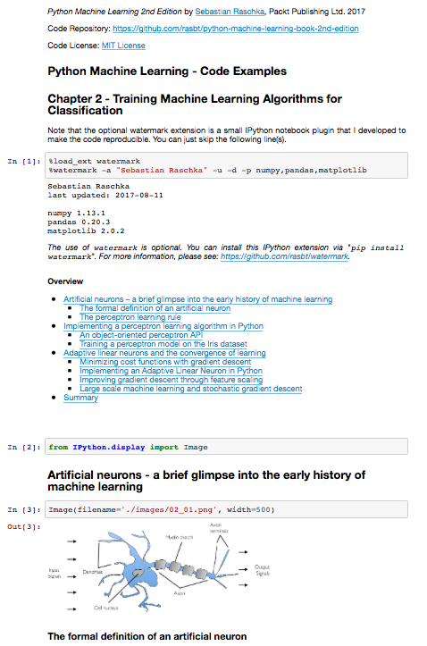

Python. Uczenie maszynowe - kod źródłowy

##  Rozdział 3. Stosowanie klasyfikatorów uczenia maszynowego za pomocą biblioteki scikit-learn

### Spis treści

- Wybór algorytmu klasyfikującego
- Pierwsze kroki z biblioteką scikit-learn — uczenie perceptronu
- Modelowanie prawdopodobieństwa przynależności do klasy za pomocą regresji logistycznej
  - Teoretyczne podłoże regresji logistycznej i prawdopodobieństwa warunkowego
  - Wyznaczanie wag logistycznej funkcji kosztu
  - Przekształcanie implementacji Adaline do postaci algorytmu regresji logistycznej
  - Uczenie modelu regresji logistycznej za pomocą biblioteki scikit-learn
  - Zapobieganie przetrenowaniu za pomocą regularyzacji
- Wyznaczanie maksymalnego marginesu za pomocą maszyn wektorów nośnych
  - Teoretyczne podłoże maksymalnego marginesu
  - Rozwiązywanie przypadków nieliniowo rozdzielnych za pomocą zmiennych uzupełniających
  - Alternatywne implementacje w interfejsie scikit-learn
- Rozwiązywanie nieliniowych problemów za pomocą jądra SVM
  - Metody jądrowe dla danych nierozdzielnych liniowo
  - Stosowanie sztuczki z funkcją jądra do znajdowania przestrzeni rozdzielających w przestrzeni wielowymiarowej
- Uczenie drzew decyzyjnych
  - Maksymalizowanie przyrostu informacji — osiąganie jak największych korzyści
  - Budowanie drzewa decyzyjnego
  - Łączenie wielu drzew decyzyjnych za pomocą modelu losowego lasu
- Algorytm k-najbliższych sąsiadów — model leniwego uczenia
- Podsumowanie

### Informacje na temat korzystania z kodu źródłowego

Zalecanym sposobem przeglądania kodu źródłowego opisywanego w książce jest aplikacja Jupyter Notebook (pliki w formacie `.ipynb`). W ten sposób jesteś w stanie realizować poszczególne fragmenty kodu krok po kroku, a wszystkie wyniki (łącznie z wykresami i rysunkami) są wygodnie generowane w jednym dokumencie.

Konfiguracja aplikacji Jupyter Notebook jest naprawdę prosta: jeżeli korzystasz z platformy Anaconda Python, wystarczy wpisać w terminalu poniższą komendę, aby zainstalować wspomniany program:

    conda install jupyter notebook

Teraz możesz uruchomić aplikację Jupyter Notebook w następujący sposób:

    jupyter notebook

Zostanie otwarte nowe okno w Twojej przeglądarce, w którym możesz przejść do katalogu docelowego zawierającego plik `.ipynb`, który zamierzasz otworzyć.

**Dodatkowe instrukcje dotyczące instalacji i konfiguracji znajdziesz w [pliku CZYTAJ.md w katalogu poświęconym rozdziałowi 1.](../r01/CZYTAJ.md)**.

**(nawet jeśli nie zamierzasz instalować aplikacji Jupyter Notebook, możesz przeglądać notatniki w serwisie GitHub. Wystarczy je kliknąć: [`r03.ipynb`](r03.ipynb))**

Oprócz samego kodu źródłowego, dołączyłem również w każdym notatniku Jupyter spis treści, a także nagłówki sekcji, które są spójne z treścią książki. Ponadto umieściłem również występujące w niej rysunki, dzięki czemu powinno Ci się łatwiej przeglądać zawartość plików i pracować z kodem.

Tworząc te notatniki przyświecał mi cel jak największego ułatwienia Tobie ich przeglądania (i tworzenia kodu)! Jeśli jednak nie zamierzasz korzystać z aplikacji Jupyter Notebook, przekonwertowałem te notatniki również do postaci standardowych plików skryptowych Pythona (w formacie `.py`), które można przeglądać i edytować w dowolnym edytorze tekstu.