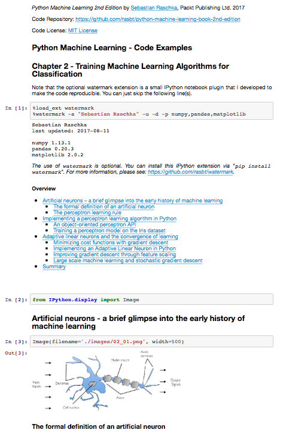

Python. Uczenie maszynowe - kod źródłowy

##  Rozdział 14. Czas na szczegóły — mechanizm działania biblioteki TensorFlow

### Spis treści

- Cechy kluczowe TensorFlow
  - Grafy obliczeniowe TensorFlow: migracja do wersji TensorFlow 2
     - Grafy obliczeniowe
     - Tworzenie grafu w wersji TensorFlow 1.x
     - Migracja grafu do wersji TensorFlow 2
     - Wczytywanie danych wejściowych do modelu: TensorFlow 1.x
     - Wczytywanie danych wejściowych do modelu: TensorFlow 2
     - Poprawianie wydajności obliczeniowej za pomocą dekoratorów funkcji
  - Obiekty Variable służące do przechowywania i aktualizowania parametrów modelu
  - Obliczanie gradientów za pomocą różniczkowania automatycznego i klasy GradientTape
     - Obliczanie gradientów funkcji straty w odniesieniu do zmiennych modyfikowalnych
     - Obliczanie gradientów w odniesieniu do tensorów niemodyfikowalnych
     - Przechowywanie zasobów na obliczanie wielu gradientów
- Upraszczanie implementacji popularnych struktur za pomocą interfejsu Keras
  - Rozwiązywanie problemu klasyfikacji XOR
  - Zwiększenie możliwości budowania modeli za pomocą interfejsu funkcyjnego Keras
  - Implementowanie modeli bazujących na klasie Model
  - Pisanie niestandardowych warstw Keras
- Estymatory TensorFlow
  - Praca z kolumnami cech
  - Uczenie maszynowe za pomocą gotowych estymatorów
  - Stosowanie estymatorów w klasyfikacji zestawu pisma odręcznego MNIST
  - Tworzenie niestandardowego estymatora z istniejącego modelu Keras
- Podsumowanie

### Informacje na temat korzystania z kodu źródłowego

Zalecanym sposobem przeglądania kodu źródłowego opisywanego w książce jest aplikacja Jupyter Notebook (pliki w formacie `.ipynb`). W ten sposób jesteś w stanie realizować poszczególne fragmenty kodu krok po kroku, a wszystkie wyniki (łącznie z wykresami i rysunkami) są wygodnie generowane w jednym dokumencie.

Konfiguracja aplikacji Jupyter Notebook jest naprawdę prosta: jeżeli korzystasz z platformy Anaconda Python, wystarczy wpisać w terminalu poniższą komendę, aby zainstalować wspomniany program:

    conda install jupyter notebook

Teraz możesz uruchomić aplikację Jupyter Notebook w następujący sposób:

    jupyter notebook

Zostanie otwarte nowe okno w Twojej przeglądarce, w którym możesz przejść do katalogu docelowego zawierającego plik `.ipynb`, który zamierzasz otworzyć.

**Dodatkowe instrukcje dotyczące instalacji i konfiguracji znajdziesz w [pliku CZYTAJ.md w katalogu poświęconym rozdziałowi 1.](../r01/CZYTAJ.md)**.

**(nawet jeśli nie zamierzasz instalować aplikacji Jupyter Notebook, możesz przeglądać notatniki w serwisie GitHub. Wystarczy je kliknąć: [`r14_cz1.ipynb`](r14_cz1.ipynb), [`r14_cz2.ipynb`](r14_cz2.ipynb) i [`r14_cz3.ipynb`](r14_cz3.ipynb))**

Oprócz samego kodu źródłowego, dołączyłem również w każdym notatniku Jupyter spis treści, a także nagłówki sekcji, które są spójne z treścią książki. Ponadto umieściłem również występujące w niej rysunki, dzięki czemu powinno Ci się łatwiej przeglądać zawartość plików i pracować z kodem.

Tworząc te notatniki przyświecał mi cel jak największego ułatwienia Tobie ich przeglądania (i tworzenia kodu)! Jeśli jednak nie zamierzasz korzystać z aplikacji Jupyter Notebook, przekonwertowałem te notatniki również do postaci standardowych plików skryptowych Pythona (w formacie `.py`), które można przeglądać i edytować w dowolnym edytorze tekstu. 
