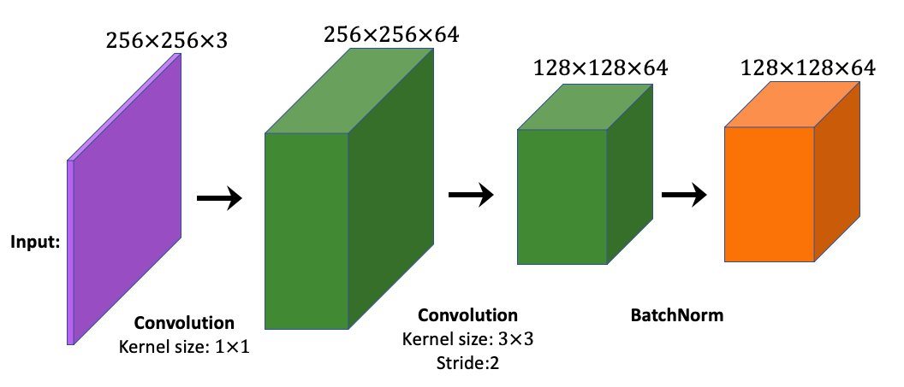

# Ćwiczenia do rozdziału 15.

## Zagadnienia powiązane, ale wykraczające poza zakres książki

*Nie da się rozwiązać zadanych tu ćwiczeń bez dalszego zagłębienia się w tematykę.*

1. Jaka jest całkowita liczba modyfikowalnych parametrów w poniższym bloku sieci CNN? Blok ten składa się z dwóch warstw splotowych i warstwy normalizacji wsadowej.

