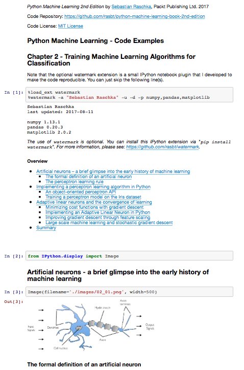

Python. Uczenie maszynowe - kod źródłowy

##  Rozdział 5. Kompresja danych poprzez redukcję wymiarowości

### Spis treści

- Nienadzorowana redukcja wymiarowości za pomocą analizy głównych składowych
  - Podstawowe etapy analizy głównych składowych
  - Wydobywanie głównych składowych krok po kroku
  - Wyjaśniona wariancja całkowita
  - Transformacja cech
  - Analiza głównych składowych w interfejsie scikit-learn
- Nadzorowana kompresja danych za pomocą liniowej analizy dyskryminacyjnej
  - Porównanie analizy głównych składowych z liniową analizą dyskryminacyjną
  - Wewnętrzne mechanizmy działania liniowej analizy dyskryminacyjnej
  - Obliczanie macierzy rozproszenia
  - Dobór dyskryminant liniowych dla nowej podprzestrzeni cech
  - Rzutowanie przykładów na nową przestrzeń cech
  - Implementacja analizy LDA w bibliotece scikit-learn
- Jądrowa analiza głównych składowych jako metoda odwzorowywania nierozdzielnych liniowo klas
  - Funkcje jądra oraz sztuczka z funkcją jądra
  - Implementacja jądrowej analizy głównych składowych w Pythonie
    - Przykład 1. Rozdzielanie sierpowatych kształtów
    - Przykład 2. Rozdzielanie koncentrycznych kręgów
  - Rzutowanie nowych punktów danych
  - Algorytm jądrowej analizy głównych składowych w bibliotece scikit-learn
- Podsumowanie

### Informacje na temat korzystania z kodu źródłowego

Zalecanym sposobem przeglądania kodu źródłowego opisywanego w książce jest aplikacja Jupyter Notebook (pliki w formacie `.ipynb`). W ten sposób jesteś w stanie realizować poszczególne fragmenty kodu krok po kroku, a wszystkie wyniki (łącznie z wykresami i rysunkami) są wygodnie generowane w jednym dokumencie.

Konfiguracja aplikacji Jupyter Notebook jest naprawdę prosta: jeżeli korzystasz z platformy Anaconda Python, wystarczy wpisać w terminalu poniższą komendę, aby zainstalować wspomniany program:

    conda install jupyter notebook

Teraz możesz uruchomić aplikację Jupyter Notebook w następujący sposób:

    jupyter notebook

Zostanie otwarte nowe okno w Twojej przeglądarce, w którym możesz przejść do katalogu docelowego zawierającego plik `.ipynb`, który zamierzasz otworzyć.

**Dodatkowe instrukcje dotyczące instalacji i konfiguracji znajdziesz w [pliku CZYTAJ.md w katalogu poświęconym rozdziałowi 1.](../r01/CZYTAJ.md)**.

**(nawet jeśli nie zamierzasz instalować aplikacji Jupyter Notebook, możesz przeglądać notatniki w serwisie GitHub. Wystarczy je kliknąć: [`r05.ipynb`](r05.ipynb))**

Oprócz samego kodu źródłowego, dołączyłem również w każdym notatniku Jupyter spis treści, a także nagłówki sekcji, które są spójne z treścią książki. Ponadto umieściłem również występujące w niej rysunki, dzięki czemu powinno Ci się łatwiej przeglądać zawartość plików i pracować z kodem.

Tworząc te notatniki przyświecał mi cel jak największego ułatwienia Tobie ich przeglądania (i tworzenia kodu)! Jeśli jednak nie zamierzasz korzystać z aplikacji Jupyter Notebook, przekonwertowałem te notatniki również do postaci standardowych plików skryptowych Pythona (w formacie `.py`), które można przeglądać i edytować w dowolnym edytorze tekstu. 