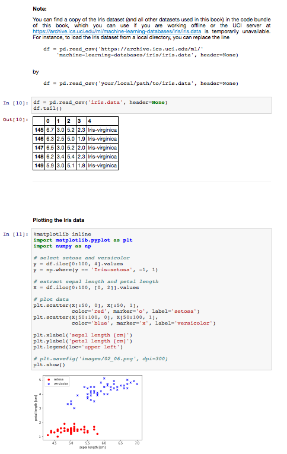

Python. Uczenie maszynowe - kod źródłowy

##  Rozdział 11. Praca z nieoznakowanymi danymi — analiza skupień

### Spis treści

- Grupowanie obiektów na podstawie podobieństwa przy użyciu algorytmu centroidów
  - Algorytm centroidów w bibliotece scikit-learn
  - Inteligentniejszy sposób dobierania pierwotnych centroidów za pomocą algorytmu k-means++
  - Twarda i miękka analiza skupień
  - Stosowanie metody łokcia do wyszukiwania optymalnej liczby skupień
  - Ujęcie ilościowe jakości analizy skupień za pomocą wykresu profilu
- Organizowanie skupień do postaci drzewa skupień
  - Oddolne grupowanie skupień
  - Przeprowadzanie hierarchicznej analizy skupień na macierzy odległości
  - Dołączanie dendrogramów do mapy cieplnej
  - Aglomeracyjna analiza skupień w bibliotece scikit-learn
- Wyznaczanie rejonów o dużej gęstości za pomocą algorytmu DBSCAN
- Podsumowanie

### Informacje na temat korzystania z kodu źródłowego

Zalecanym sposobem przeglądania kodu źródłowego opisywanego w książce jest aplikacja Jupyter Notebook (pliki w formacie `.ipynb`). W ten sposób jesteś w stanie realizować poszczególne fragmenty kodu krok po kroku, a wszystkie wyniki (łącznie z wykresami i rysunkami) są wygodnie generowane w jednym dokumencie.

Konfiguracja aplikacji Jupyter Notebook jest naprawdę prosta: jeżeli korzystasz z platformy Anaconda Python, wystarczy wpisać w terminalu poniższą komendę, aby zainstalować wspomniany program:

    conda install jupyter notebook

Teraz możesz uruchomić aplikację Jupyter Notebook w następujący sposób:

    jupyter notebook

Zostanie otwarte nowe okno w Twojej przeglądarce, w którym możesz przejść do katalogu docelowego zawierającego plik `.ipynb`, który zamierzasz otworzyć.

**Dodatkowe instrukcje dotyczące instalacji i konfiguracji znajdziesz w [pliku CZYTAJ.md w katalogu poświęconym rozdziałowi 1.](../r01/CZYTAJ.md)**.

**(nawet jeśli nie zamierzasz instalować aplikacji Jupyter Notebook, możesz przeglądać notatniki w serwisie GitHub. Wystarczy je kliknąć: [`r11.ipynb`](r11.ipynb))**

Oprócz samego kodu źródłowego, dołączyłem również w każdym notatniku Jupyter spis treści, a także nagłówki sekcji, które są spójne z treścią książki. Ponadto umieściłem również występujące w niej rysunki, dzięki czemu powinno Ci się łatwiej przeglądać zawartość plików i pracować z kodem.

Tworząc te notatniki przyświecał mi cel jak największego ułatwienia Tobie ich przeglądania (i tworzenia kodu)! Jeśli jednak nie zamierzasz korzystać z aplikacji Jupyter Notebook, przekonwertowałem te notatniki również do postaci standardowych plików skryptowych Pythona (w formacie `.py`), które można przeglądać i edytować w dowolnym edytorze tekstu.