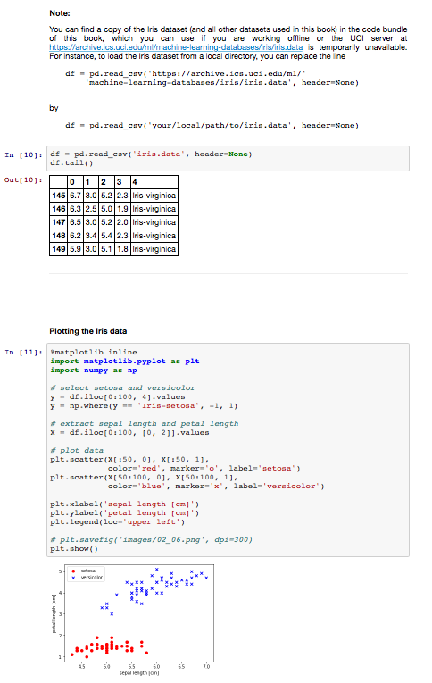

Python. Uczenie maszynowe - kod źródłowy

##  Rozdział 18. Uczenie przez wzmacnianie jako mechanizm podejmowania decyzji w skomplikowanych środowiskach

### Spis treści

- Wprowadzenie: uczenie z doświadczenia
  - Filozofia uczenia przez wzmacnianie
  - Definicja interfejsu agent-środowisko w systemie uczenia przez wzmacnianie
  - Podstawy teoretyczne uczenia przez wzmacnianie
    - Procesy decyzyjne Markowa
    - Wyjaśnienie matematyczne procesów decyzyjnych Markowa
    - Wizualizacja procesu Markowa
    - Zadania epizodyczne a zadania ciągłe
  - Terminologia uczenia przez wzmacnianie: zwrot, strategia i funkcja wartości
    - Zwrot
    - Strategia
    - Funkcja wartości
  - Programowanie dynamiczne za pomocą równania Bellmana
- Algorytmy uczenia przez wzmacnianie
  - Programowanie dynamiczne
    - Ocena strategii: przewidywanie funkcji wartości za pomocą programowania dynamicznego
    - Usprawnianie strategii za pomocą oszacowanej funkcji wartości
    - Iteracja strategii
    - Iteracja wartości
  - Uczenie przez wzmacnianie metodą Monte Carlo
    - Oszacowanie funkcji wartości stanu metodą Monte Carlo
    - Oszacowanie funkcji wartości czynności metodą Monte Carlo
    - Wyszukiwanie optymalnej strategii za pomocą sterowania Monte Carlo
    - Usprawnianie strategii: obliczanie strategii zachłannej z funkcji wartości czynności
  - Uczenie metodą różnic czasowych
    - Predykcja w metodzie różnic czasowych
    - Sterowanie strategiczne w metodzie różnic czasowych (SARSA)
    - Sterowanie niestrategiczne w metodzie różnic czasowych (Q-uczenie)
- Implementacja naszego pierwszego algorytmu uczenia przez wzmacnianie
  - Wprowadzenie do pakietu OpenAI Gym
    - Korzystanie z dostępnych środowisk w OpenAI Gym
  - Przykład świata blokowego
    - Implementacja środowiska świata blokowego w pakiecie OpenAI Gym
  - Rozwiązywanie problemu świata blokowego za pomocą Q-uczenia
    - Implementacja algorytmu Q-uczenia
- Krótko o algorytmie Q-uczenia głębokiego
  - Trenowanie modelu DQN za pomocą algorytmu Q-uczenia
    - Pamięć odtwarzania
    - Określanie wartości docelowych potrzebnych do obliczania funkcji straty
  - Implementacja algorytmu Q-uczenia głębokiego
- Podsumowanie rozdziału i książki

### Informacje na temat korzystania z kodu źródłowego

Zalecanym sposobem przeglądania kodu źródłowego opisywanego w książce jest aplikacja Jupyter Notebook (pliki w formacie `.ipynb`). W ten sposób jesteś w stanie realizować poszczególne fragmenty kodu krok po kroku, a wszystkie wyniki (łącznie z wykresami i rysunkami) są wygodnie generowane w jednym dokumencie.

Konfiguracja aplikacji Jupyter Notebook jest naprawdę prosta: jeżeli korzystasz z platformy Anaconda Python, wystarczy wpisać w terminalu poniższą komendę, aby zainstalować wspomniany program:

    conda install jupyter notebook

Teraz możesz uruchomić aplikację Jupyter Notebook w następujący sposób:

    jupyter notebook

Zostanie otwarte nowe okno w Twojej przeglądarce, w którym możesz przejść do katalogu docelowego zawierającego plik `.ipynb`, który zamierzasz otworzyć.

**Dodatkowe instrukcje dotyczące instalacji i konfiguracji znajdziesz w [pliku CZYTAJ.md w katalogu poświęconym rozdziałowi 1.](../r01/CZYTAJ.md)**.

**(nawet jeśli nie zamierzasz instalować aplikacji Jupyter Notebook, możesz przeglądać notatniki w serwisie GitHub. Wystarczy je kliknąć: [`r18.ipynb`](r18.ipynb))**

Oprócz samego kodu źródłowego, dołączyłem również w każdym notatniku Jupyter spis treści, a także nagłówki sekcji, które są spójne z treścią książki. Ponadto umieściłem również występujące w niej rysunki, dzięki czemu powinno Ci się łatwiej przeglądać zawartość plików i pracować z kodem.

Tworząc te notatniki przyświecał mi cel jak największego ułatwienia Tobie ich przeglądania (i tworzenia kodu)! Jeśli jednak nie zamierzasz korzystać z aplikacji Jupyter Notebook, przekonwertowałem te notatniki również do postaci standardowych plików skryptowych Pythona (w formacie `.py`), które można przeglądać i edytować w dowolnym edytorze tekstu. 
